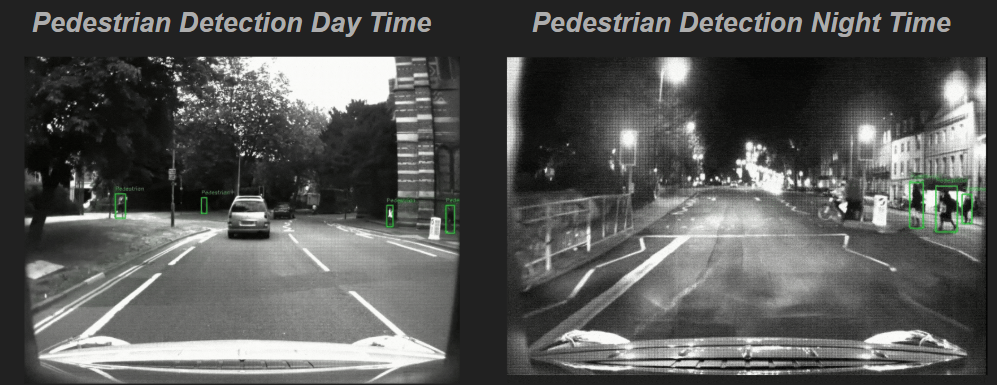
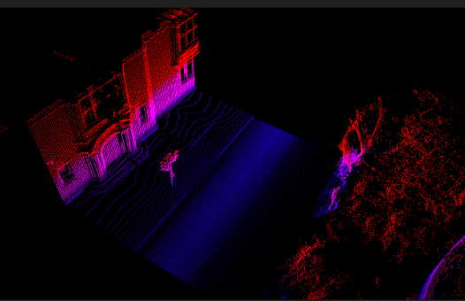
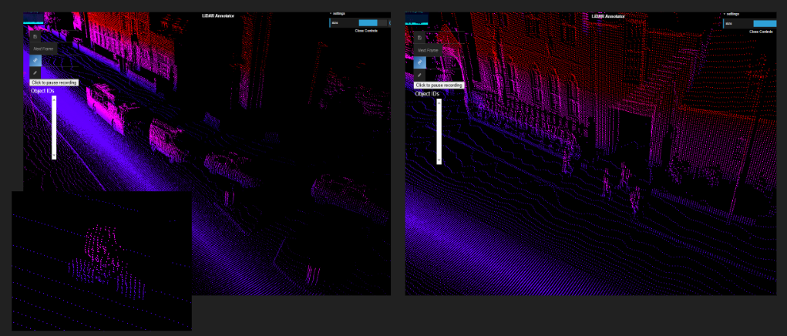

# Pedestrian Detection in Urban Environments

This repository contains a multimodal approach to pedestrian detection in urban environments, combining computer vision and LIDAR data processing. The project focuses on robust pedestrian detection in various lighting conditions and environments.

## Overview

The project consists of two main components:

1. **Vision-based Pedestrian Detection**: Uses computer vision techniques (YOLOv8) to detect pedestrians in video streams and images.
2. **LIDAR-based Detection and Filtering**: Processes point cloud data to identify and filter objects, with specific focus on pedestrian detection.

## Project Structure

```
.
├── PedestrianDetection/
│   ├── detector.py            # Unified pedestrian detector (images & videos)
│   └── video_creator.py       # Utility to create videos from image sequences
├── LidarProcessing/
│   ├── filter.py              # Point cloud filtering utilities
│   └── lidar_visualizer.py    # LIDAR visualization and pedestrian detection
├── images/                    # Sample images and results
├── utils.py                   # Common utility functions
├── run_example.py             # All-in-one example script
└── requirements.txt           # Project dependencies
```

## Setup and Installation

1. Clone this repository:
   ```bash
   git clone https://github.com/yourusername/pedestrian-detection.git
   cd pedestrian-detection
   ```

2. Install the required dependencies:
   ```bash
   pip install -r requirements.txt
   ```

3. Download the model files (not included in the repository due to size):
   - YOLOv8 model: Place `yolov8n.pt` in the project root or in the PedestrianDetection directory
   - YOLOv5 model: Place `yolov5s.pt` in the project root or in the LidarProcessing directory
   - Custom model: Place `model.pt` in the project root or in the PedestrianDetection directory
   
   Alternatively, you can specify the model path when running the scripts.

## Usage

### Quick Start with Example Script

The easiest way to try out all the tools is to use the example script:

```bash
# Run with a video file
python run_example.py --video /path/to/video.mp4 --output_dir outputs

# Run with an image file 
python run_example.py --image /path/to/image.jpg --model /path/to/yolov8n.pt

# Run with a point cloud file
python run_example.py --point_cloud /path/to/pointcloud.bin --model /path/to/yolov5s.pt

# Run multiple components at once
python run_example.py --video /path/to/video.mp4 --point_cloud /path/to/pointcloud.bin

# Show results interactively (for images and point clouds)
python run_example.py --image /path/to/image.jpg --interactive

# Specify class ID for detection
python run_example.py --video /path/to/video.mp4 --class_id 1
```

For help and more options:
```bash
python run_example.py --help
```

### Individual Component Usage

#### Vision-based Pedestrian Detection

```bash
# Detect pedestrians in a video file
python PedestrianDetection/detector.py video.mp4 --output output_dir --mode video

# Detect pedestrians in an image
python PedestrianDetection/detector.py image.jpg --output result.jpg --mode image --show

# Automatically detect input type (video or image)
python PedestrianDetection/detector.py input_file --output output_path

# Use a specific model with class ID
python PedestrianDetection/detector.py input_file --model /path/to/model.pt --class_id 1
```

Example of pedestrian detection results:


#### Create video from image sequence

```bash
# Create a video from a sequence of images
python PedestrianDetection/video_creator.py image_folder output_video.mp4 --fps 30
```

#### LIDAR Point Cloud Processing

```bash
# Basic point cloud filtering
python LidarProcessing/filter.py input_file.bin output_file.bin

# Integrated pedestrian detection with LIDAR
python LidarProcessing/lidar_visualizer.py input_file.bin --model /path/to/yolov5s.pt --output results.ply --no-visualize
```

Example of LIDAR processing results:



## Results

The implemented system achieves robust pedestrian detection in various conditions, including low-light environments where traditional vision-only approaches might fail.

## Key Features

- Unified pedestrian detection for both images and videos
- Automatic input type detection
- LIDAR point cloud filtering and clustering
- Integration of vision and LIDAR data for robust detection
- Support for real-time processing
- Portable code that runs on any system without hardcoded paths
- Common utilities for model loading and path handling

## Dependencies

- numpy
- ultralytics (YOLOv8)
- opencv-python
- tqdm
- scikit-learn
- open3d
- torch
- pillow

## Future Work

- Integration with ROS (Robot Operating System)
- Real-time performance optimization
- Additional sensor fusion techniques
- Extension to other object classes beyond pedestrians

## License

This project is available under the MIT License. 